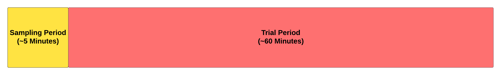
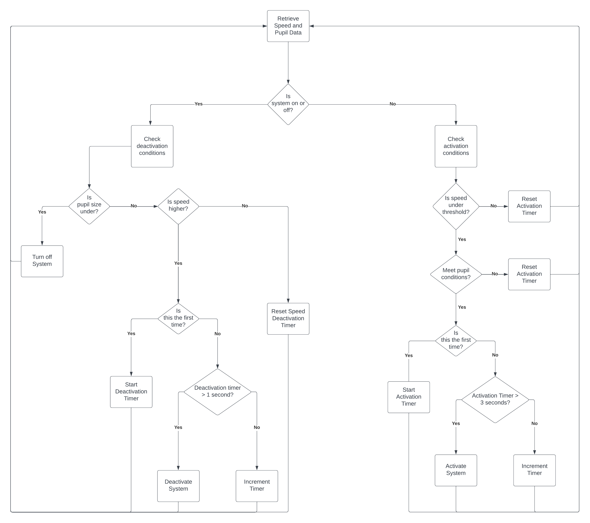

# MousePupilTracker

# Introduction
This program is an automated script that controls a real-time closed loop system that activates an optogenetic system based on a mouse's pupil size and speed. It is able to track the mouse's pupil size using a convolutional neural network (CNN) through a ResNet-50 backbone that was trained using DeepLabCut. The model was trained using videos of the different mice as their pupils change over time. Using the trained model, real-time processing of the mouse's pupil size can be done using a Webcam. The system also utilizes an Arduino which sends speed data from a running disk to the script. The Arduino is also responsible for sending a TTL signal to a Doric LED Driver, which will activate an optogenetic laser. The pupil size and speed of the mouse is graphed live onto a GUI, and it is also logged in a file. The program is split into two sections: A sampling period and a trial period. The sampling period is the first 5 minutes of the program. It will only record the pupil size of the mouse and record it in a file. After the sampling period, calculations are performed to determine conditions for activating the system. Once done, the trial period starts, which will start the closed loop system.





# Setting Up

### Installing DeepLabCut Live
Follow this [tutorial.](https://github.com/DeepLabCut/DeepLabCut-live/blob/master/docs/install_desktop.md).

### Other Libraries Needed
- keyboard
- matplotlib
- numpy
- opencv
- pyserial
- PyYAML

These can be installed using the anaconda environment that was used to install deeplabcut-live. First, activate the anaconda environment
```
activate dlc-live
```
Next, locate this repository directory. Once at the root directory for this project, you can pip install the required libraries.
```
cd ....../MousePupilTracker
pip install -r requirements.txt
```

# Running the Project
The project can be used by running `main.py`. Open up Anaconda prompt and make sure to activate the environment if not done so already. Afterwards, locate the directory for this file.
```
activate dlc-live
cd ...../MousePupilTracker
```
Next, you want to type in this command and it should run the program.
```
python main.py
```

# Project Outline
```
MousePupilTracker
├───Arduino
│   └───OptoCode
|       └───OptoCode.ino
├───Data
|   ├───config.yaml
│   └───Logs
│       ├───Mouse1_Trial1
│       ├───Mouse1_Trial2
│       └───Mouse1_Trial3
├───PupilTracker
│   ├───DLC_Mice_resnet_50_iteration-1_shuffle-1
│   ├───Arduino.py
│   ├───Controller.py
│   ├───Graph.py
|   ├───GUI.py
│   ├───Logger.py
│   ├───PupilProcessor.py
│   ├───ThresholdCalculator.py
│   └───Webcamp.py
├───MouseTracker.py
└───Main.py
```

Below shown is the general layout of how these modules communicate with the MouseTracker program and how the other components interact with each other.


## Arduino
The Arduino folder will contain the .ino file that controls the Arduino. The Arduino is responsible for calculating the speed of the running disk and sending it to the computer, and it also receives signals from the computer if it needs to fire a TTL pulse. If the Arduino receives a signal of `1`, it will turn on the pulse code. If the Arduino receives a signal of `0`, it will turn off the pulse code. The Arduino code has three changeable parameters: `timeOn`, `timeOff`, `radius`. 

```
timeOn   - how long the TTL signal is on per pulse
timeOff  - how long the TTL signal is off per pulse
radius   - radius of the running disk
```

The Arduino layout is as follows:


***NOTE***: Components in the image are just representations (the actual parts I couldn't find, so I used something similar). The wire colors are accurate. The light bulb is supposed to represent the optogenetic machine. The motor encoder is supposed to have 4 wires only. And the LED represents the light source inside the cage.

The important pins are:
```
Pin         Type of I/O               Purpose
-----------------------------------------------------------
Pin 13      Digital Output            To produce TTL Signal, connects to the Doric LED Driver
Pin 10      Digital Output            To power the light source inside the cage
Pin 2       Digital Input             To get the first input of the quadrature encoder, for the running disk
Pin 3       Digital Input             To get the second input of the quadrature encoder, for the running disk
```
All the components will need to be connected to a ground (black). The running disk will need to be connected to a 5V source (connect red to 5V).

## Data
The Data folder will contain the `config.yaml` file and the `Logs` folder. The `config.yaml` file will save the parameters that is displayed in the GUI. Generally, this file does not need to be editted since any changes you add in the GUI will automatically load it onto the config file. The `Logs` folder will contain log information such as pupil size, speed bins, and timestamps of on and off for each trial. Each time the program is run, it will create a new folder inside the `Logs` folder, and dump all the information there.

A single log folder will contain 4 files: `Sample.csv`, `Trial.csv`, `Speed.csv`, and `ThresholdParams.txt`.

```
Sample.csv           - This will contain the pupil size of the sampling period
Trial.csv            - After the sampling period, timestamps of activation and pupil size are dumped here 
Speed.csv            - After the sampling period, 10 ms bins of speed every 1 second will be dumped here
ThresholdParams.txt  - After the sampling period, it will calculate the mean and standard deviation and store them here.
```

## PupilTracker
The PupilTracker contains Python modules that help the program function. It also contains the DeepLabCut model that is used for live tracking of the pupil size.


### Arduino.py
This class is responsible for recieving and sending data to and from the arduino. It automatically looks at each serial port and sets up an arduino object. It then starts a daemon thread that will run in the background constantly receiving data from the arduino. An individual speed data is saved in a variable called `data`, and the speed bins that contain 1 second worth of data spaced at 10ms intervals is stored in the `bin` array. It is also responsible for sending signals to the Arduino, which will be used to activate a TTL pulse. The `Arduino.py` file contains 9 functions:

```
__init__    - Initializes the Arduino object and automatically searchs for the Arduino port
status      - Returns the status of an Arduino: True if Arduino is connected, False if no Arduino is connected
start       - Starts the thread to begin working in the background
stop        - Stops the thread
read        - The threaded target, will run in the background receiving speed signals and storing it in the bin every 10 ms
getValue    - Helper function (used in MouseTracker.py) to return the value of current speed
write       - Helper function (used in Controller.py) to write data to the Arduino
isFloat     - Helper function to determine if the received input is a valid float (don't want things to crash :P)
getBin      - Helper function (used in Logger.py) to return the last 1 second bin of speed values
```

### Controller.py
This class is responsible for controlling the whole closed loop system. It will recieves inputs about the speed and pupil size, and will determine if it should activate or not. The `Controller.py` class contains 8 functions.

```
__init__     - Initializes the Controller object, setting up the parameters like thresholds and activation times.
start        - Starts the thread to begin working in the background
stop         - Stops the thread
run          - The threaded target, will run in the background constantly receiving information about pupil size and diameter and activating the system to send a TTL pulse. Flow chart of how it works down below.
activate     - Tells the Arduino object to send a signal to the Arduino to actiate TTL pulse
deactivate   - Tells the Arduino object to send a signal to the Arduino to deactivate TTL pulse
updateValues - Gets the speed and diameter values from MouseTracker.py and updates it for the background thread
getStatus    - Helper function (used for Logger.py) to determine the status of system (1 if on, 0 if off)
```

Below is the flowchart the lays out the logic of the controller.


### Graph.py
This class is responsible graphing the speed value, the pupil value, and the pupil threshold value live. During the sampling period, it will only display the pupil size and the speed. But after the sampling period, it will display the threshold after the calculations are done. The `animate` function is responsible for setting up the values and the graph, this function will be called repeatedly by the matplotlib `FuncAnimation` function. The `plot` function is responsible for setting up the animation function and running the plot live. When the graph process is started, it will be given three parameters `diameter`, `speed`, `thresh`, and `config`. `config` is used to retrieve the threshold value and plot it on the graph when trial period starts. The other three: `diameter`, `speed`, and `thresh` are all Multiprocessing variables, which are able to share data between two processes (since the grapher is running on a seperate process since matplotlib doesn't work on a thread). The `MouseTracker.py` file will constantly update `diameter` and `speed` so that the graphing process can plot it live. The `thresh` variable is actually an array containing two items. At the beginning of the program, the two items are NaN, but after the sample period and the mean and standard deviation are calculated, those values will fill the array.

```
thresh[0] = mean
thresh[1] = std
```

The `thresh` array is used so that it can perform Z-score calculations during the trial period and plot it on the graph.


### Logger.py
This class is responsible for logging all the data into files, like the pupil size, the disk speed bins, and timestamps of system activation. It has two "modes" for logging. The first is **Sample**, which only records the pupil size, this will generate the `Sample.csv` file. The second is **Trial**, which records the pupil size, the timestamps, and the disk speed bins. In **Trial** mode, it generates two different files: `Trial.csv` and `Speed.csv`. It contains 8 functions.

```
__init__         - Initializes the Logger object, setting up the parameters like the save directory
start            - Starts the thread to begin working in the background
stop             - Stops the thread
writeData        - The threaded target, will run in the background constantly writing data to the files
update           - Gets the speed bins, diameter values, and system status from MouseTracker.py and updates it for the background thread
turnBintoString  - Helper function to turn the speed bins into a printable string to put in the CSV file
getDirec         - Helper function (used for ThresholdCalculator.py) to get the directory of the folder of where the logs are being stored.
setType          - Helper function (used by MouseTracker.py) to set the mode of logging (Sample or Trial)
```

### PupilProcessor.py
This class is responsible for doing the pupil diameter calculations by getting the data directly from DeepLabCut and using the points to calculate the diameter. The main function to worry about is the `process` function. Every time a frame is evaluated by the DeepLabCut model, it will produce an array which contain positions and confidences of different points. This model has 9 point of interest, indicating a specific location in the pupil:

```
0. centre
1. top
2. bottom
3. left
4. right
5. topleft
6. topright
7. bottomleft
8. bottomright
```

Once the frame has been processed and the data points are collected, the code looks to see if there is a confident center. If it is, it records the position of it and loops through all the other data points. It checks each data point to see if its confidence (greater than 0.8), and if it is a good and active point, it calculates its distance from the center, basically calculating radius. The calculated radiuses are then averaged and multiplied by 2, giving the average diameter.

In the code, there will a variable called `pose`. `pose` contains all the points, its coordinates, and its confidence (how certain is that point an actual pointer as determined by the model) stored into an array arranged like this:
```
Index:       0     1       2
             x     y    confidence
0  centre   20    30    0.99
1  top      80    200   0.98
2  bottom   10    10    0.83
...
```

So for example, if you wanted to access the left data point's coordinates. You would have to call
```
x = pose[3, 0]
y = pose[3, 1]

The first number in the brackets represent which item (row) you want to use (left = 3).
The second number in the brackets represent which property (column) you want to use (x = 0, y = 1, confidence = 2).
```


### ThresholdCalculator.py
This class is responsible for calculating the threshold by getting the Sample data and calculating the standard deviation and mean. After calculating, it will store those values to the `ThresholdParams.txt` file. This class is only used right after the sampling period has ended. It has 4 functions.

```
__init__    - Initializes the ThresholdCalculator object, getting the directory for the current logs
run         - Reads the Sample.csv file and calculates the mean and standard deviation 
getMean     - Helper function to return the calculated mean
getSTD      - Helper function to return the calculated standard deviation
```

### Webcam.py
This class is responsible for setting up the webcam and getting the frames from the webcam. It has 4 functions.

```
__init__  - Initializes the Webcam object
start     - Turns on the camera and sets up its parameters. Returns False if camera cannot be found
close     - Turns off the camera
getFrame  - Gets the current camera frame, does some pre-processing, and returns the frame
```

### GUI.py
This class is responsible for setting up the GUI at the beginning where trial parameters can be changed. The GUI is seperated into two sections: The Controller Conditions and the Sample/Trial Conditions. The Controller Conditions frame contains the labels and the text entries that is used to modify the parameters for the controller. The Sample/Trial Conditions frame contains the labels and text entires for changing the parameters of the sample and trial durations. When the GUI is first started, it loads the config.yaml file to load the previous parameters from the last time it was run. Once the start button is clicked, it will save all those parameters into the config.yaml file.


## Main.py
This is the main file which runs everything. It will first start the GUI, where parameters can be changed. Once the parameters are changed and the start button is clicked, it will start the MouseTracker program.

## MouseTracker.py
This is the central station, where it controls the flow of the program. It is responsible for setting up the Camera, the Arduino, the PupilProcessor, the Logger, the Grapher, and the Controller. Here is where most of the information is sent to, and the MouseTracker program is able to control where and what information is sent. General flow chart of the mouse tracker:


  
